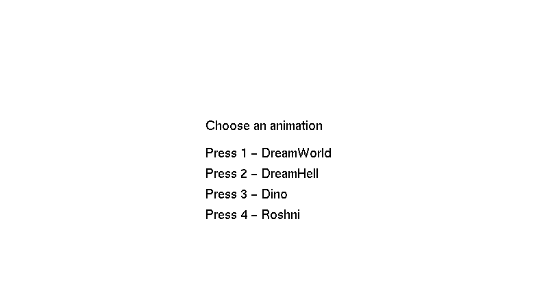
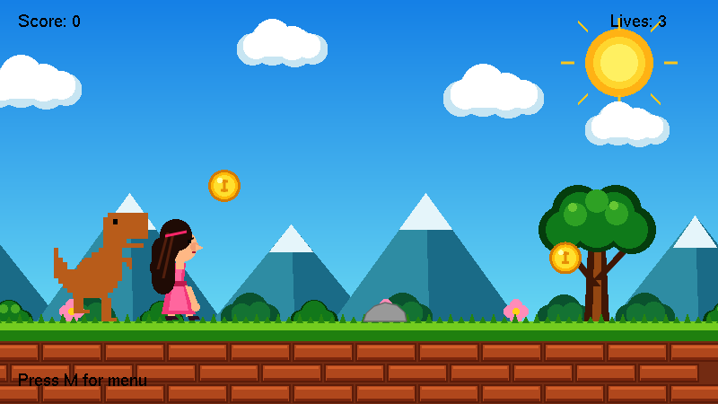
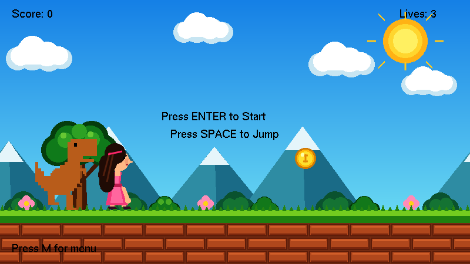
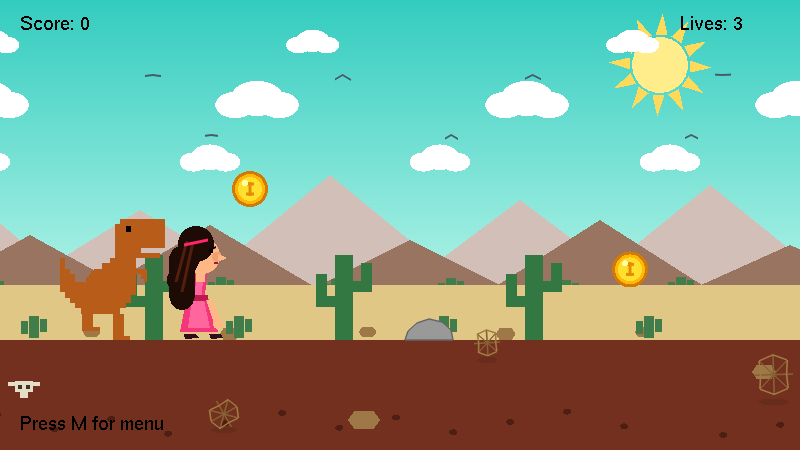
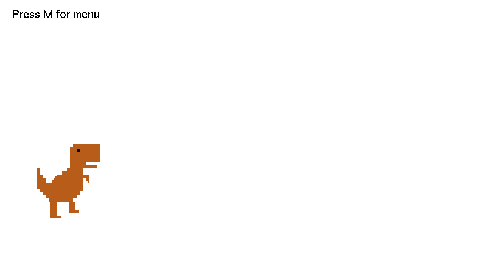
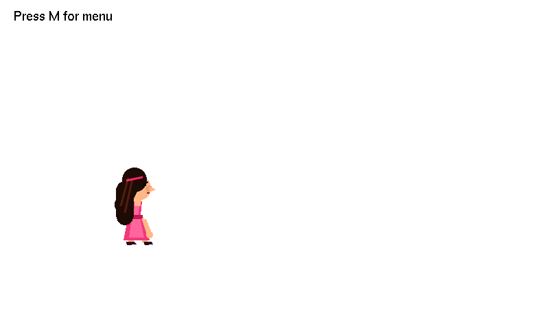
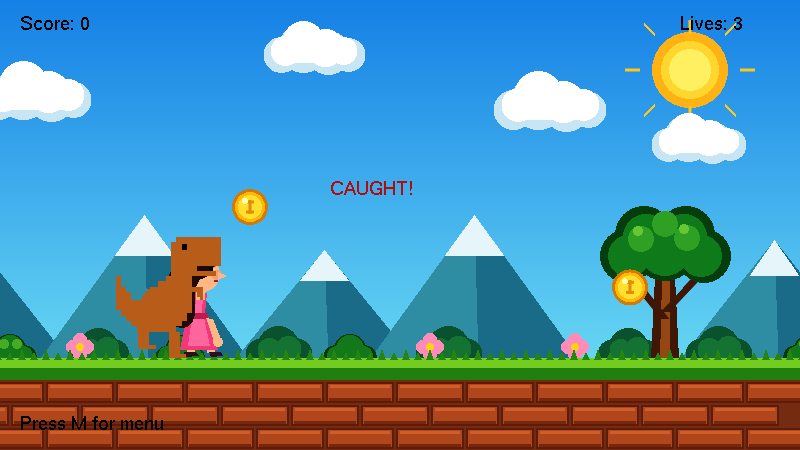
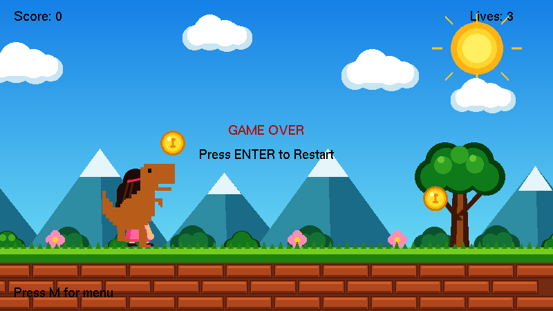

# Stone Runner — Lab Report

## 1. Front Page

**Project Title:** Stone Runner (2D Platformer Game)
*(Derived directly from the source code — `referance.cpp`'s own window is titled "Stone Runner - 2D Platformer," and `main.cpp`'s comments repeatedly refer to the game as "Stone Runner." Replace with the official assignment title if it differs.)*

**Course Name & Code:** [NEED: course name and course code]

**Section:** [NEED: section]

**Submitted To:** [NEED: faculty name]

**Group Name:** [NEED: group name]

**Submitted By:** Group Members (see Section 2)

**Submission Date:** [NEED: submission date]

---

## 2. Group Member Information

| Student ID | Name | Primary Scene / Module | Assigned Elements (as provided) |
|---|---|---|---|
| 24-56637-1 | Siam Hossain | DreamHell (Desert Scene) | Ground, Cactus, "marge"¹, Sound² |
| 23-53027-3 | Sumaiya Akter Roshni | DreamWorld (Grass Scene) + Player | Girl, Cloud, Sun, Sky, Mountain, Brick, Coin, Lives |
| 24-56642-1 | Ashraful Islam Siam | DreamHell (Desert Scene) | Sun, Sky, Cloud, Birds, Mountain |
| 24-55989-1 | Sharif Eime Akhter³ | DreamWorld (Grass Scene) + Dino | Dinosaur, Tree, Grass, Flower, Stone, Score |

¹ **[NEED: clarification on "marge"]** — this term does not match any function, variable, or comment found in the current `DreamHell.cpp`/`DreamHell.h` source. If it refers to a specific effect (e.g., a heat-mirage shimmer, or the sand/dirt band "merge"), please specify so the exact code can be cited in Section 10.

² **[NEED: sound/audio source code]** — no audio-related code (sound library includes, play-sound calls, etc.) exists in any of the source files reviewed for this report (`main.cpp`, `DreamWorld.cpp`, `DreamHell.cpp`, `dragon.cpp`, `roshni_player.cpp`). Please provide the implementation if it exists in a different file/branch, or confirm this feature is planned but not yet implemented.

³ The task list you provided spells this name "Sharif Eime Akter"; the ID roster spells it "Sharif Eime Akhter." The roster spelling is used consistently in this report — please confirm the correct spelling.

---

## 3. Table of contents

| Section | Page |
|---|---|
| 1. Front Page | [TBD] |
| 2. Group Member Information | [TBD] |
| 3. Table of contents | [TBD] |
| 4. Introduction | [TBD] |
| 5. Proposal | [TBD] |
| 6. Schematic Diagram | [TBD] |
| 7. List of objects | [TBD] |
| 8. Functions to represent the objects | [TBD] |
| 9. Interactive functions | [TBD] |
| 10. Task Assignment and codes of functions. | [TBD] |
| 11. Conclusion | [TBD] |

*(Page numbers are left as placeholders — once this document is opened in Word, an automatic Table of Contents can be inserted via References → Table of Contents, since all section headings below already use Word's built-in Heading styles.)*

---

## 4. Introduction

This project applies core concepts of computer graphics programming and event-driven software design using C++ and the OpenGL Utility Toolkit (GLUT). Rather than relying on external image/texture assets, every visual element in the project — sky, terrain, characters, obstacles, and collectibles — is constructed entirely from OpenGL's immediate-mode primitives (`glBegin`/`glVertex2f`/`glEnd` with `GL_QUADS`, `GL_TRIANGLES`, `GL_POLYGON`, and `GL_LINES`), combined with simple procedural drawing routines.

The motivation behind the project is twofold: first, to gain hands-on experience translating basic 2D geometric shapes into a coherent, layered animated scene (parallax scrolling backgrounds, multi-pose character animation); and second, to practice structuring a C++ program around GLUT's callback-driven execution model (`glutDisplayFunc`, `glutKeyboardFunc`, `glutTimerFunc`) together with a simple finite-state machine to manage game states (start, playing, game over, caught).

The objective of the project is to implement a small 2D endless-runner platformer, "Stone Runner," featuring:
- Two selectable, fully animated background scenes (a grass/daytime scene and a desert scene).
- A playable character that can run and jump.
- An antagonist character that catches the player when they run out of lives.
- A simple scoring and lives system driven by collectible coins and obstacle stones.

---

## 5. Proposal

**What the project does.** Stone Runner is a single-executable C++/GLUT application that opens on a menu screen and lets the user choose, via the number keys, between four views: (1) the DreamWorld (grass) scene with the runner mini-game active, (2) the DreamHell (desert) scene with the same mini-game active, (3) a standalone preview of the antagonist "Dino" character, and (4) a standalone preview of the playable "Roshni" character. Pressing **M** returns to the menu from any view, and **ESC** exits the program.

Within either scene (1 or 2), the runner mini-game plays the same way regardless of which background is showing: the player character auto-scrolls through the world, the user presses **SPACE** to jump over stone obstacles, and coins drift across the screen to be collected simply by touching them. Colliding with a stone costs one life and two points (after a brief invulnerability/flash window); collecting a coin adds one point. Running speed increases gradually with score. When lives reach zero, the antagonist dinosaur sprints toward the player, "catches" her, and the game transitions to a Game Over screen; pressing **ENTER** restarts the run.

**Scope.** The project scope covers: two hand-built animated background scenes; two hand-built animated characters; a shared scoring/lives/collision system; and the GLUT event loop wiring that ties menu navigation, keyboard input, and per-frame animation together. It does not include external art assets, sound (see Section 2, footnote 2), networking, or persistence (no save/load of high scores).

**Problem it solves.** The project demonstrates that a complete, playable 2D game can be built using only OpenGL's legacy immediate-mode drawing primitives and simple procedural/modular C++ — without a game engine, sprite sheets, or texture assets — while still achieving layered scenery (parallax), multi-pose character animation, basic physics (a semi-implicit Euler jump arc), and axis-aligned bounding-box (AABB) collision detection.

---

## 6. Schematic Diagram

The following screenshots were captured directly from the compiled program and show each screen the user can reach from the menu.

### 6.1 Menu Screen (program start)

{width=5.8in}

### 6.2 Press 1 — DreamWorld (Grass Scene)

{width=5.8in}

{width=5.8in}

### 6.3 Press 2 — DreamHell (Desert Scene)

{width=5.8in}

### 6.4 Press 3 — Dragon (Dino) Preview

{width=5.8in}

### 6.5 Press 4 — Roshni (Player) Preview

{width=5.8in}

### 6.6 Game States

{width=5.8in}

{width=5.8in}

### 6.7 Program Structure

The screens above are produced by a single controller module that owns the game state and drives four independent visual/character modules:

```
                         +---------------------------+
                         |   main.cpp (Controller)   |
                         |---------------------------|
                         | GLUT callbacks:           |
                         |  display() / update() /   |
                         |  keyboard() / init()      |
                         |                           |
                         | Shared game state:        |
                         |  gameState, score, lives, |
                         |  stoneX[], coinX/Y[]      |
                         |                           |
                         | Shared drawing primitives:|
                         |  drawRect() drawCircle()  |
                         |  drawText()               |
                         +---------------------------+
                          |        |        |       |
             (extern)     |        |        |       |     (extern)
        +-----------------+  +-----+---+  +-+-----+ +-----+--------------+
        |                    |         |  |       |       |              |
        v                    v         v  v       v       v              v
+----------------+   +----------------+  +-----------+  +--------------------+
|  DreamWorld    |   |   DreamHell    |  |  dragon   |  |   roshni_player    |
|  (Grass Scene) |   | (Desert Scene) |  |  (Dino)   |  |   (Player/Girl)    |
+----------------+   +----------------+  +-----------+  +--------------------+
| drawBackground |   | drawDreamHell  |  | drawDino  |  | drawPlayer         |
| backgroundAnim |   | dreamHellAnim  |  | dinoAnim  |  | playerAnimate      |
+----------------+   +----------------+  | dinoChase |  | playerJumpStart/   |
                                         | dinoReset |  | playerJumpUpdate   |
                                         +-----------+  +--------------------+
```

Each of the four side modules exposes only a small public interface (declared in its `.h` file) while keeping its internal helper functions and state `static` (file-private). `main.cpp` is the only module that both supplies functions to, and consumes functions from, every other module, making it the integration point for the whole program.

## 7. List of objects

**Note on terminology:** the project is implemented in a procedural/modular style in C++ — no `class` keyword is used anywhere in the source. Each module (its own `.cpp`/`.h` pair, or a section of `main.cpp`) keeps its internal data as file-scope `static` variables and exposes a small public function interface, which is functionally equivalent to an object with private state and public methods, implemented through translation-unit encapsulation rather than a C++ class.

At module level the project contains six such objects:

| Object (Module) | Files | One-line purpose |
|---|---|---|
| Shared Drawing Primitives | `main.cpp` | Provides the three low-level shape/text drawing routines (`drawRect`, `drawCircle`, `drawText`) every other module builds on. |
| DreamWorld (Grass Scene) | `DreamWorld.cpp`, `Header/DreamWorld.h` | Draws and animates the grass/brick background scene. |
| DreamHell (Desert Scene) | `DreamHell.cpp`, `Header/DreamHell.h` | Draws and animates the desert background scene. |
| Dragon / Dino | `dragon.cpp`, `Header/dragon.h` | Draws and animates the antagonist dinosaur, including its scripted chase. |
| Roshni Player | `roshni_player.cpp`, `Header/roshni_player.h` | Draws and animates the playable girl character, including jump physics. |
| Game Controller | `main.cpp` (run-game section + GLUT wiring) | Owns the shared score/lives/coins/stones state, the state machine, collision detection, and the GLUT callback wiring. |

The individual drawable objects that make up those modules are catalogued below. Every image was rendered directly by the project's own drawing functions, isolated one object at a time.

### 7.1 Characters and Gameplay Objects

{width=2.4in}

{width=1.7in}

{width=1.6in}

{width=2.8in}

### 7.2 DreamWorld (Grass Scene) Objects

{width=5in}

{width=2in}

{width=3in}

{width=5.5in}

{width=3.5in}

{width=1.7in}

{width=2.2in}

{width=1.8in}

{width=2.5in}

{width=5.5in}

### 7.3 DreamHell (Desert Scene) Objects

{width=5in}

{width=2in}

{width=2.8in}

{width=2.4in}

{width=4in}

{width=1.8in}

{width=2in}

{width=4.5in}

{width=2.2in}

{width=2.4in}

{width=1.8in}

## 8. Functions to represent the objects

### Object: Shared Drawing Primitives (`main.cpp`)

| Function | Explanation |
|---|---|
| `void drawRect(float x1, float y1, float x2, float y2)` | Draws an axis-aligned filled rectangle between two corner points using `GL_QUADS`. |
| `void drawCircle(float cx, float cy, float r)` | Draws a filled circle at `(cx, cy)` with radius `r`, approximated as a 40-sided polygon. |
| `void drawText(float x, float y, const char *text)` | Draws a string of bitmap text at `(x, y)` using GLUT's Helvetica-18 bitmap font. |

### Object: DreamWorld (Grass Scene)

| Function | Explanation |
|---|---|
| `void drawBackground()` *(public)* | Draws the entire grass scene, back to front, including two tiled copies of each scrolling layer for seamless wraparound. |
| `void backgroundAnimate(float speed, bool running)` *(public)* | Advances all six scroll offsets by one frame; clouds always scroll, the rest only while `running` is true. |
| `static void drawSky()` | Draws the blue sky gradient. |
| `static void drawSun()` | Draws the fixed sun with rays at a set screen position. |
| `static void drawClouds()` | Draws four decorative cloud clusters. |
| `static void drawMountains()` | Draws four layered triangular mountains with snow caps. |
| `static void drawBackgroundBushes()` | Draws five small background bush clusters. |
| `static void drawTree()` | Draws a single large tree (trunk, branches, and layered foliage). |
| `static void drawBushes()` | Draws three foreground bush clusters. |
| `static void drawFlowers()` | Draws three flower clusters. |
| `static void drawBrick()` | Draws one brick shape at its own local origin. |
| `static void drawGrassBlades()` | Draws one tuft of two grass blades at its own local origin. |
| `static void drawGround()` | Draws the dirt/brick path and grass band, tiling `drawBrick()` and `drawGrassBlades()` along scrolling offsets. |

### Object: DreamHell (Desert Scene)

| Function | Explanation |
|---|---|
| `void drawDreamHell()` *(public)* | Draws the entire desert scene, back to front. |
| `void dreamHellAnimate()` *(public)* | Advances the scene's internal clock (`gTime`) and spins the sun. |
| `static float wrapX(float x0, float speed, float margin)` | Computes a horizontally wrapping x-position for a scrolling element based on `gTime`. |
| `static void drawEllipse(float cx, float cy, float rx, float ry)` | Draws a filled ellipse, used as the base shape for clouds and sun body. |
| `static void drawSky()` | Draws the teal-to-white sky gradient. |
| `static void drawSun(float cx, float cy)` | Draws the rotating sun with 12 triangular rays at a given position. |
| `static void drawCloud(float x, float y, float size)` | Draws one cloud from three overlapping ellipses. |
| `static void drawCloudRow(float y, float size, float gap, float speed)` | Draws a horizontally repeating, endlessly scrolling row of clouds. |
| `static void drawBird(float x, float y, float size, float wing)` | Draws one bird as a simple V-shaped wing pair. |
| `static void drawBirdRow(float y, float size, float gap, float speed)` | Draws a scrolling row of birds with wings flapping via a sine function. |
| `static void drawMountain(...)` | Draws one triangular mountain with a given color/size. |
| `static void drawMountains()` | Draws a back row and front row of mountains using `drawMountain()`. |
| `static void drawGround()` | Draws the dirt band with scattered pebbles, and the sand band above it. |
| `static void drawRock(float x, float y, float w, float h)` | Draws one six-sided rock. |
| `static void drawCactus(float x, float bottom)` | Draws one large cactus (a tall body plus two arms). |
| `static void drawSmallCactus(float x, float bottom)` | Draws one small cactus. |
| `static void drawTumbleweed(float cx, float groundY, float r, float speed)` | Draws one tumbleweed with a bouncing, spinning, and shadow animation. |
| `static void drawSkull(float x, float y)` | Draws a cow skull decoration. |

### Object: Dragon / Dino

| Function | Explanation |
|---|---|
| `void drawDino()` *(public)* | Draws the dino's body plus whichever running-leg pose is current. |
| `float dinoGetX()` *(public)* | Returns the dino's current world x-position. |
| `void dinoAnimate(float speed)` *(public)* | Advances the running-leg pose swap timer; faster `speed` swaps legs faster. |
| `bool dinoChase()` *(public)* | Advances the dino 4 units per call toward the player during the "caught" sequence; returns `true` once `dinoX >= 200`. |
| `void dinoReset()` *(public)* | Resets the dino to its starting position and pose. |
| `static void drawDinoBody()` | Draws the dino's torso, neck, head, tail, and spine spikes as a series of rectangles. |
| `static void drawDinoLegsRun1()` / `static void drawDinoLegsRun2()` | Draw the two alternating running-leg poses. |

### Object: Roshni Player

| Function | Explanation |
|---|---|
| `void drawPlayer()` *(public)* | Draws the current leg pose first, then the body/dress on top. |
| `float playerGetY()` *(public)* | Returns the player's current vertical (jump) position; 92 when grounded. |
| `bool playerIsJumping()` *(public)* | Returns whether the player is currently airborne. |
| `void playerJumpStart()` *(public)* | Begins a jump (`jumpSpeed = 10`); ignored if already jumping. |
| `void playerJumpUpdate()` *(public)* | Integrates one frame of the jump arc and lands the player once `playerY <= 92`. |
| `void playerAnimate(float speed)` *(public)* | Advances the running-leg pose swap timer while grounded; freezes pose 1 while airborne. |
| `void playerReset()` *(public)* | Resets the player to grounded, not-jumping, first running pose. |
| `static void drawPlayerLegs1()` / `static void drawPlayerLegs2()` | Draw the two alternating running-leg poses. |
| `static void drawPlayerBody()` | Draws the dress, arms, head, hair, and face. |

### Object: Game Controller

| Function | Explanation |
|---|---|
| `static bool rectHit(...)` | Generic axis-aligned rectangle-overlap test used by both collision checks. |
| `static void drawCoin()` | Draws one coin (three concentric circles, a "$"-like cross, and a highlight). |
| `static void drawStone()` | Draws one stone obstacle as a filled + outlined polygon. |
| `static void checkCoins()` | Tests the player's hitbox against each alive coin; on overlap, marks it collected and adds one point. |
| `static void checkStones()` | Tests the player's hitbox against each stone; on overlap (and no active invulnerability), removes a life, subtracts two points, starts the flash timer, and triggers the "caught" state if lives reach zero. |
| `static void drawGameUI()` | Draws the Score/Lives text and the state-dependent prompts (Start / Caught / Game Over). |
| `static void resetRun()` | Seeds the RNG once, resets score/lives/speed, resets the dino and player, and lays out the stones and coins for a new run. |
| `static void drawGame(float groundOffset)` | Shared per-frame renderer for both scenes; draws coins, then either the running layout or the caught/game-over layout. |
| `static void animateGame()` | Shared per-frame updater; advances speed, scrolls/wraps/bobs stones and coins, drives character animation, runs collision checks, and drives the caught→game-over transition. |
| `static void gameKeyPress(unsigned char key)` | Handles ENTER (start/restart) and SPACE (jump) while a scene is active. |
| `void drawMenu()` | Draws the four-option number-keyed menu text. |
| `void display()` | GLUT display callback; branches on the selected view and renders it. |
| `void update(int value)` | GLUT timer callback (16 ms); advances background/game/character animation and reschedules itself. |
| `void keyboard(unsigned char key, int x, int y)` | GLUT keyboard callback; switches views, forwards to `gameKeyPress()`, handles menu/exit. |
| `void init()` | One-time OpenGL/window setup (clear color, blending, orthographic projection) and starts the first run. |
| `int main(int argc, char** argv)` | Program entry point; creates the GLUT window and registers all callbacks. |

---

## 9. Interactive functions

These are the functions that either take direct user input or drive the interactive loop in response to it:

| Function | Role in interaction |
|---|---|
| `keyboard(unsigned char key, int x, int y)` | The primary input handler (GLUT keyboard callback). Number keys **1–4** switch between the two scenes and the two character previews; **M** returns to the menu; **ESC** exits; while a scene is active, keys are forwarded to `gameKeyPress()`. |
| `gameKeyPress(unsigned char key)` | Interprets **ENTER** (13) as start/restart — calls `resetRun()` and sets `gameState = 1` — and **SPACE** as jump, but only while `gameState == 1` (playing). |
| `playerJumpStart()` | Interactive trigger invoked directly from `keyboard()` (scene 4 preview) or via `gameKeyPress()` (in-game); begins the jump arc if the player is not already airborne. |
| `display()` | Not itself input-driven, but every frame it re-reads the interactively-set `selected` variable to decide what to render — the visible effect of the user's last keypress. |
| `update(int value)` | The 16 ms timer tick that turns the current interactive state (`selected`, `gameState`) into continuous animation and gameplay progression each frame; it reschedules itself via `glutTimerFunc`, so it is what makes the program responsive in real time rather than static. |
| `init()` / `main()` | Not interactive themselves, but they are what create the window and register `display`, `keyboard`, and `update` as GLUT's active callbacks, making all of the above possible. |

---

## 10. Task Assignment and codes of functions.

### 10.1 Task Assignment Table

| Member | ID | Object/Module | Function(s) | Assigned Feature |
|---|---|---|---|---|
| Ashraful Islam Siam | 24-56642-1 | DreamHell | `drawSky`, `drawSun(cx,cy)` | Sun, Sky |
| Ashraful Islam Siam | 24-56642-1 | DreamHell | `drawCloud`, `drawCloudRow` | Cloud |
| Ashraful Islam Siam | 24-56642-1 | DreamHell | `drawBird`, `drawBirdRow` | Birds |
| Ashraful Islam Siam | 24-56642-1 | DreamHell | `drawMountain`, `drawMountains` | Mountain |
| Siam Hossain | 24-56637-1 | DreamHell | `drawGround`, `drawRock` | Ground |
| Siam Hossain | 24-56637-1 | DreamHell | `drawCactus`, `drawSmallCactus` | Cactus |
| Siam Hossain | 24-56637-1 | DreamHell | `drawSkull`, `drawTumbleweed` | (grouped under "Ground" — see note below) |
| Siam Hossain | 24-56637-1 | — | — | "marge" — **[NEED: clarification, no matching code found]** |
| Siam Hossain | 24-56637-1 | — | — | Sound — **[NEED: source code, none found]** |
| Sumaiya Akter Roshni | 23-53027-3 | Roshni Player | All of `roshni_player.cpp` | Girl |
| Sumaiya Akter Roshni | 23-53027-3 | DreamWorld | `drawClouds` | Cloud |
| Sumaiya Akter Roshni | 23-53027-3 | DreamWorld | `drawSun`, `drawSky` | Sun, Sky |
| Sumaiya Akter Roshni | 23-53027-3 | DreamWorld | `drawMountains` | Mountain |
| Sumaiya Akter Roshni | 23-53027-3 | DreamWorld | `drawBrick` | Brick |
| Sumaiya Akter Roshni | 23-53027-3 | Game Controller | `drawCoin`, `checkCoins` | Coin |
| Sumaiya Akter Roshni | 23-53027-3 | Game Controller | `checkStones` (life deduction), `drawGameUI` (Lives display) | Lives |
| Sharif Eime Akhter | 24-55989-1 | Dragon / Dino | All of `dragon.cpp` | Dinosaur |
| Sharif Eime Akhter | 24-55989-1 | DreamWorld | `drawTree` | Tree |
| Sharif Eime Akhter | 24-55989-1 | DreamWorld | `drawGrassBlades` | Grass |
| Sharif Eime Akhter | 24-55989-1 | DreamWorld | `drawFlowers` | Flower |
| Sharif Eime Akhter | 24-55989-1 | Game Controller | `drawStone`, `checkStones` (collision) | Stone |
| Sharif Eime Akhter | 24-55989-1 | Game Controller | `checkCoins`/`checkStones` (score math), `drawGameUI` (Score display) | Score |

**Notes on shared/joint functions:** `checkStones()` performs both the stone-collision test *and* the life deduction in a single function, and `drawGameUI()` prints both Score and Lives in a single function — the source code does not separate these concerns into independent functions per feature. They are therefore listed under both relevant members above and reproduced once in Section 10.2 rather than duplicated. `drawGround()`, `drawSky()`, and `drawBushes()` in `DreamWorld.cpp`, and `wrapX`/`drawEllipse` in `DreamHell.cpp`, are not explicitly named in the task list you provided; they are included below as supporting/shared code required to render the assigned elements, marked *(unattributed / supporting)*.

### 10.2 Source Code by Object/Module

#### A. DreamHell Module — *Ashraful Islam Siam (Sun, Sky, Cloud, Birds, Mountain) & Siam Hossain (Ground, Cactus)*

```cpp
// --- Shared helpers (unattributed / supporting) ---

static float wrapX(float x0, float speed, float margin)
{
    float span = 800.0f + 2.0f * margin;
    float x = fmodf(x0 - speed * gTime, span);
    if (x < 0.0f) x += span;
    return x - margin;
}

static void drawEllipse(float cx, float cy, float rx, float ry)
{
    glBegin(GL_POLYGON);
    for (int i = 0; i < 28; i++)
    {
        float angle = (i * 2 * PI) / 28;
        glVertex2f(cx + rx * cos(angle), cy + ry * sin(angle));
    }
    glEnd();
}

// --- Ashraful Islam Siam: Sky, Sun ---

static void drawSky()
{
    glBegin(GL_QUADS);
        glColor3f(0.20f, 0.80f, 0.75f);
        glVertex2f(0, 450);
        glVertex2f(800, 450);
        glColor3f(0.68f, 0.95f, 0.90f);
        glVertex2f(800, 165);
        glVertex2f(0, 165);
    glEnd();
}

static void drawSun(float cx, float cy)
{
    glPushMatrix();

    glTranslatef(cx, cy, 0);
    glRotatef(sunAngle, 0, 0, 1);

    glColor3f(1.0f, 0.85f, 0.35f);
    for (int i = 0; i < 12; i++)
    {
        glBegin(GL_TRIANGLES);
            glVertex2f(-6, 30);
            glVertex2f( 6, 30);
            glVertex2f( 0, 52);
        glEnd();

        glRotatef(30, 0, 0, 1);
    }

    glColor3f(1.0f, 0.93f, 0.55f);
    drawEllipse(0, 0, 28, 28);

    glPopMatrix();
}

// --- Ashraful Islam Siam: Cloud ---

static void drawCloud(float x, float y, float size)
{
    glPushMatrix();
        glTranslatef(x, y, 0);
        glScalef(size, size, 1.0f);

        glColor3f(1.0f, 1.0f, 1.0f);

        drawEllipse(-20,  0, 18, 12);
        drawEllipse( 20,  0, 18, 12);
        drawEllipse(  0,  6, 24, 16);
    glPopMatrix();
}

static void drawCloudRow(float y, float size, float gap, float speed)
{
    int count = 800 / gap + 3;
    float rowLength = count * gap;

    for (int i = 0; i < count; i++)
    {
        float x = i * gap - speed * gTime;

        while (x < -gap)
            x = x + rowLength;

        drawCloud(x, y, size);
    }
}

// --- Ashraful Islam Siam: Birds ---

static void drawBird(float x, float y, float size, float wing)
{
    glColor3f(0.28f, 0.36f, 0.42f);
    glLineWidth(2.0f);

    glBegin(GL_LINES);
        glVertex2f(x - 8 * size, y + wing);
        glVertex2f(x,y);

        glVertex2f(x,            y);
        glVertex2f(x + 8 * size, y + wing);
    glEnd();
}

static void drawBirdRow(float y, float size, float gap, float speed)
{
    int count = 800 / gap + 3;
    float rowLength = count * gap;

    for (int i = 0; i < count; i++)
    {
        float x = i * gap - speed * gTime;

        while (x < -gap)
            x = x + rowLength;

        float wing = 5 * size * sin(gTime * 6 + i);

        drawBird(x, y, size, wing);
    }
}

// --- Ashraful Islam Siam: Mountain ---

static void drawMountain(float x, float bottom, float width, float height,
                  float r, float g, float b)
{
    glColor3f(r, g, b);

    glBegin(GL_TRIANGLES);
        glVertex2f(x - width, bottom);
        glVertex2f(x + width, bottom);
        glVertex2f(x, bottom + height);
    glEnd();
}

static void drawMountains()
{
    drawMountain(-40, 160, 120, 100, 0.82f, 0.75f, 0.72f);
    drawMountain(140, 160, 130,  80, 0.82f, 0.75f, 0.72f);
    drawMountain(330, 160, 140, 115, 0.82f, 0.75f, 0.72f);
    drawMountain(520, 160, 120,  90, 0.82f, 0.75f, 0.72f);
    drawMountain(710, 160, 130, 105, 0.82f, 0.75f, 0.72f);

    drawMountain( 30, 160, 100,  55, 0.60f, 0.46f, 0.38f);
    drawMountain(210, 160, 110,  65, 0.60f, 0.46f, 0.38f);
    drawMountain(410, 160, 100,  50, 0.60f, 0.46f, 0.38f);
    drawMountain(600, 160, 110,  70, 0.60f, 0.46f, 0.38f);
    drawMountain(790, 160, 100,  45, 0.60f, 0.46f, 0.38f);
}

// --- Siam Hossain: Ground ---

static void drawGround()
{
    glColor3f(0.45f, 0.19f, 0.12f);
    drawRect(0, 0, 800, 110);

    glColor3f(0.30f, 0.12f, 0.08f);
    for (int i = 0; i < 14; i++)
    {
        float px = wrapX(40 + i * 57.0f, 95.0f, 20.0f);
        float py = 15 + 25 * fmod(i * 37, 90) / 90;
        drawEllipse(px, py, 4, 3);
    }

    glColor3f(0.88f, 0.78f, 0.52f);
    drawRect(0, 110, 800, 165);
}

static void drawRock(float x, float y, float w, float h)
{
    glColor3f(0.62f, 0.47f, 0.28f);
    glBegin(GL_POLYGON);
        glVertex2f(x - w,        y);
        glVertex2f(x - w * 0.6f, y + h);
        glVertex2f(x + w * 0.6f, y + h);
        glVertex2f(x + w,        y);
        glVertex2f(x + w * 0.6f, y - h);
        glVertex2f(x - w * 0.6f, y - h);
    glEnd();
}

// --- Siam Hossain: Cactus ---

static void drawCactus(float x, float bottom)
{
    glColor3f(0.20f, 0.47f, 0.26f);

    glBegin(GL_QUADS);
        glVertex2f(x - 9, bottom);
        glVertex2f(x + 9, bottom);
        glVertex2f(x + 9, bottom + 85);
        glVertex2f(x - 9, bottom + 85);
    glEnd();

    glBegin(GL_QUADS);
        glVertex2f(x - 28, bottom + 33);
        glVertex2f(x -  9, bottom + 33);
        glVertex2f(x -  9, bottom + 44);
        glVertex2f(x - 28, bottom + 44);
    glEnd();

    glBegin(GL_QUADS);
        glVertex2f(x - 28, bottom + 33);
        glVertex2f(x - 17, bottom + 33);
        glVertex2f(x - 17, bottom + 66);
        glVertex2f(x - 28, bottom + 66);
    glEnd();

    glBegin(GL_QUADS);
        glVertex2f(x +  9, bottom + 48);
        glVertex2f(x + 28, bottom + 48);
        glVertex2f(x + 28, bottom + 59);
        glVertex2f(x +  9, bottom + 59);
    glEnd();

    glBegin(GL_QUADS);
        glVertex2f(x + 17, bottom + 48);
        glVertex2f(x + 28, bottom + 48);
        glVertex2f(x + 28, bottom + 77);
        glVertex2f(x + 17, bottom + 77);
    glEnd();
}

static void drawSmallCactus(float x, float bottom)
{
    glColor3f(0.25f, 0.49f, 0.29f);

    glBegin(GL_QUADS);
        glVertex2f(x - 5, bottom);
        glVertex2f(x + 5, bottom);
        glVertex2f(x + 5, bottom + 22);
        glVertex2f(x - 5, bottom + 22);
    glEnd();

    glBegin(GL_QUADS);
        glVertex2f(x - 13, bottom + 4);
        glVertex2f(x -  6, bottom + 4);
        glVertex2f(x -  6, bottom + 17);
        glVertex2f(x - 13, bottom + 17);
    glEnd();

    glBegin(GL_QUADS);
        glVertex2f(x +  6, bottom + 6);
        glVertex2f(x + 13, bottom + 6);
        glVertex2f(x + 13, bottom + 19);
        glVertex2f(x +  6, bottom + 19);
    glEnd();
}

// --- Ground clutter (unattributed by name — see Section 10.1 note) ---

static void drawTumbleweed(float cx, float groundY, float r, float speed)
{
    float bounce = fabs(sin(gTime * speed / (r * 2.4f))) * (r * 0.7f);
    float angle  = -(gTime * speed) / r * (180.0f / PI);

    float sh = r * (1.0f - bounce / (r * 2.5f));
    float d  = r * 0.70f;
    float n  = r * 0.46f;

    glColor4f(0.30f, 0.14f, 0.08f, 0.30f);
    glBegin(GL_POLYGON);
        glVertex2f(cx - sh,        groundY + 2);
        glVertex2f(cx - sh * 0.6f, groundY + 5);
        glVertex2f(cx + sh * 0.6f, groundY + 5);
        glVertex2f(cx + sh,        groundY + 2);
        glVertex2f(cx + sh * 0.6f, groundY - 1);
        glVertex2f(cx - sh * 0.6f, groundY - 1);
    glEnd();

    glPushMatrix();

        glTranslatef(cx, groundY + r + bounce, 0);
        glRotatef(angle, 0, 0, 1);

        glColor3f(0.52f, 0.38f, 0.20f);
        glLineWidth(1.6f);
        glBegin(GL_LINES);
            glVertex2f(-r,  0);   glVertex2f( r,  0);
            glVertex2f( 0, -r);   glVertex2f( 0,  r);
            glVertex2f(-d, -d);   glVertex2f( d,  d);
            glVertex2f(-d,  d);   glVertex2f( d, -d);
        glEnd();

        glColor3f(0.63f, 0.48f, 0.26f);
        glBegin(GL_LINE_LOOP);
            glVertex2f( r,  0);
            glVertex2f( n,  n);
            glVertex2f( 0,  r);
            glVertex2f(-d,  d);
            glVertex2f(-r,  0);
            glVertex2f(-n, -n);
            glVertex2f( 0, -r);
            glVertex2f( d, -d);
        glEnd();

    glPopMatrix();
}

static void drawSkull(float x, float y)
{
    glColor3f(0.90f, 0.87f, 0.78f);

    glBegin(GL_QUADS);
        glVertex2f(x - 9, y - 2);
        glVertex2f(x + 9, y - 2);
        glVertex2f(x + 9, y + 9);
        glVertex2f(x - 9, y + 9);
    glEnd();

    glBegin(GL_QUADS);
        glVertex2f(x - 4, y - 8);
        glVertex2f(x + 4, y - 8);
        glVertex2f(x + 4, y - 2);
        glVertex2f(x - 4, y - 2);
    glEnd();

    glBegin(GL_QUADS);
        glVertex2f(x - 16, y + 4);
        glVertex2f(x -  9, y + 4);
        glVertex2f(x -  9, y + 8);
        glVertex2f(x - 16, y + 8);
    glEnd();

    glBegin(GL_QUADS);
        glVertex2f(x +  9, y + 4);
        glVertex2f(x + 16, y + 4);
        glVertex2f(x + 16, y + 8);
        glVertex2f(x +  9, y + 8);
    glEnd();

    glColor3f(0.24f, 0.20f, 0.16f);

    glBegin(GL_QUADS);
        glVertex2f(x - 6, y + 1);
        glVertex2f(x - 2, y + 1);
        glVertex2f(x - 2, y + 5);
        glVertex2f(x - 6, y + 5);
    glEnd();

    glBegin(GL_QUADS);
        glVertex2f(x + 2, y + 1);
        glVertex2f(x + 6, y + 1);
        glVertex2f(x + 6, y + 5);
        glVertex2f(x + 2, y + 5);
    glEnd();
}

// --- Integration (combines all of the above; not specific to one member) ---

void drawDreamHell()
{
    drawSky();
    drawSun(660, 385);

    drawCloudRow(405, 0.7f, 320,  5.0f);
    drawCloudRow(345, 1.1f, 270,  9.0f);
    drawCloudRow(288, 0.8f, 230, 14.0f);

    drawBirdRow(375, 1.0f, 190, 26.0f);
    drawBirdRow(315, 0.8f, 240, 20.0f);

    drawMountains();

    drawSmallCactus(wrapX( 60, 20.0f, 40.0f), 150);
    drawSmallCactus(wrapX(175, 20.0f, 40.0f), 148);
    drawSmallCactus(wrapX(290, 20.0f, 40.0f), 151);
    drawSmallCactus(wrapX(405, 20.0f, 40.0f), 149);
    drawSmallCactus(wrapX(520, 20.0f, 40.0f), 150);
    drawSmallCactus(wrapX(635, 20.0f, 40.0f), 148);
    drawSmallCactus(wrapX(750, 20.0f, 40.0f), 151);

    drawGround();

    drawRock(wrapX( 70, 60.0f, 30.0f), 116, 10, 6);
    drawRock(wrapX(208, 60.0f, 30.0f), 118,  9, 5);
    drawRock(wrapX(346, 60.0f, 30.0f), 116, 10, 6);
    drawRock(wrapX(484, 60.0f, 30.0f), 118,  9, 5);
    drawRock(wrapX(622, 60.0f, 30.0f), 116, 10, 6);
    drawRock(wrapX(760, 60.0f, 30.0f), 118,  9, 5);

    drawSmallCactus(wrapX(150, 60.0f, 30.0f), 112);
    drawSmallCactus(wrapX(355, 60.0f, 30.0f), 112);
    drawSmallCactus(wrapX(560, 60.0f, 30.0f), 112);
    drawSmallCactus(wrapX(765, 60.0f, 30.0f), 112);

    drawCactus(wrapX(120, 60.0f, 70.0f), 110);
    drawCactus(wrapX(310, 60.0f, 70.0f), 110);
    drawCactus(wrapX(500, 60.0f, 70.0f), 110);
    drawCactus(wrapX(690, 60.0f, 70.0f), 110);

    drawSkull(wrapX(300, 150.0f, 60.0f), 60);
    drawRock(wrapX(640, 150.0f, 60.0f), 30, 16, 9);
    drawRock(wrapX(120, 150.0f, 60.0f), 78, 12, 7);

    drawTumbleweed(wrapX(500,  150.0f, 60.0f), 18, 15, 150.0f);
    drawTumbleweed(wrapX(180,  185.0f, 60.0f), 46, 20, 185.0f);
    drawTumbleweed(wrapX(720,  120.0f, 60.0f), 88, 13, 120.0f);
}

void dreamHellAnimate()
{
    gTime += 0.016f;

    sunAngle += 0.3f;
    if (sunAngle > 360.0f)
        sunAngle -= 360.0f;
}
```

#### B. DreamWorld Module — *Sumaiya Akter Roshni (Cloud, Sun, Sky, Mountain, Brick) & Sharif Eime Akhter (Tree, Grass, Flower)*

```cpp
// --- Sumaiya Akter Roshni: Sky, Sun, Cloud ---

static void drawSky()
{
    glBegin(GL_QUADS);

    glColor3f(0.08f,0.50f,0.90f);
    glVertex2f(0,450);
    glVertex2f(800,450);

    glColor3f(0.40f,0.84f,0.95f);
    glVertex2f(800,90);
    glVertex2f(0,90);

    glEnd();
}

static void drawSun()
{
    glColor3f(1.0f,0.70f,0.08f);
    drawCircle(690,380,38);

    glColor3f(1.0f,0.84f,0.18f);
    drawCircle(690,380,29);

    glColor3f(1.0f,0.94f,0.38f);
    drawCircle(690,380,21);

    glColor3f(1.0f,0.78f,0.10f);
    glLineWidth(3);

    glBegin(GL_LINES);
    glVertex2f(690,430); glVertex2f(690,416);
    glVertex2f(690,344); glVertex2f(690,330);
    glVertex2f(640,380); glVertex2f(625,380);
    glVertex2f(740,380); glVertex2f(755,380);
    glVertex2f(655,415); glVertex2f(644,426);
    glVertex2f(725,415); glVertex2f(736,426);
    glVertex2f(655,345); glVertex2f(644,334);
    glVertex2f(725,345); glVertex2f(736,334);
    glEnd();
}

static void drawClouds()
{
    // four cloud clusters, each a soft-white blob drawn from
    // overlapping circles and a rectangle, in two shades for depth
    glColor3f(0.78f,0.90f,0.95f);
    drawCircle(30,350,20);  drawCircle(55,358,28);
    drawCircle(83,352,24);  drawCircle(105,350,18);
    drawRect(30,335,105,355);

    glColor3f(1.0f,1.0f,1.0f);
    drawCircle(35,355,17);  drawCircle(55,365,24);
    drawCircle(80,358,21);  drawCircle(100,355,16);
    drawRect(35,340,100,358);

    glColor3f(0.78f,0.90f,0.95f);
    drawCircle(313,395,18); drawCircle(335,402,25);
    drawCircle(360,397,22); drawCircle(380,395,17);
    drawRect(313,382,380,400);

    glColor3f(1.0f,1.0f,1.0f);
    drawCircle(317,399,15); drawCircle(335,408,21);
    drawCircle(357,402,19); drawCircle(375,399,14);
    drawRect(317,387,375,403);

    glColor3f(0.78f,0.90f,0.95f);
    drawCircle(545,340,20); drawCircle(570,348,28);
    drawCircle(598,342,24); drawCircle(620,340,18);
    drawRect(545,325,620,345);

    glColor3f(1.0f,1.0f,1.0f);
    drawCircle(550,345,17); drawCircle(570,355,24);
    drawCircle(595,348,21); drawCircle(615,345,16);
    drawRect(550,330,615,348);

    glColor3f(0.78f,0.90f,0.95f);
    drawCircle(700,305,17); drawCircle(720,312,24);
    drawCircle(744,307,21); drawCircle(762,305,16);
    drawRect(700,293,762,311);

    glColor3f(1.0f,1.0f,1.0f);
    drawCircle(704,309,14); drawCircle(720,317,20);
    drawCircle(741,312,18); drawCircle(758,309,13);
    drawRect(704,297,758,313);
}

// --- Sumaiya Akter Roshni: Mountain ---

static void drawMountains()
{
    glColor3f(0.18f,0.55f,0.64f);
    glBegin(GL_TRIANGLES); glVertex2f(-80,90); glVertex2f(15,210); glVertex2f(110,90); glEnd();

    glColor3f(0.10f,0.42f,0.53f);
    glBegin(GL_TRIANGLES); glVertex2f(15,210); glVertex2f(110,90); glVertex2f(19,90); glEnd();

    glColor3f(0.90f,0.96f,0.98f);
    glBegin(GL_TRIANGLES); glVertex2f(-10,174); glVertex2f(15,210); glVertex2f(40,174); glEnd();

    glColor3f(0.18f,0.55f,0.64f);
    glBegin(GL_TRIANGLES); glVertex2f(80,90); glVertex2f(185,235); glVertex2f(290,90); glEnd();

    glColor3f(0.10f,0.42f,0.53f);
    glBegin(GL_TRIANGLES); glVertex2f(185,235); glVertex2f(290,90); glVertex2f(189,90); glEnd();

    glColor3f(0.90f,0.96f,0.98f);
    glBegin(GL_TRIANGLES); glVertex2f(155,194); glVertex2f(185,235); glVertex2f(215,194); glEnd();

    glColor3f(0.18f,0.55f,0.64f);
    glBegin(GL_TRIANGLES); glVertex2f(275,90); glVertex2f(365,200); glVertex2f(455,90); glEnd();

    glColor3f(0.10f,0.42f,0.53f);
    glBegin(GL_TRIANGLES); glVertex2f(365,200); glVertex2f(455,90); glVertex2f(369,90); glEnd();

    glColor3f(0.90f,0.96f,0.98f);
    glBegin(GL_TRIANGLES); glVertex2f(340,169); glVertex2f(365,200); glVertex2f(390,169); glEnd();

    glColor3f(0.18f,0.55f,0.64f);
    glBegin(GL_TRIANGLES); glVertex2f(410,90); glVertex2f(515,235); glVertex2f(620,90); glEnd();

    glColor3f(0.10f,0.42f,0.53f);
    glBegin(GL_TRIANGLES); glVertex2f(515,235); glVertex2f(620,90); glVertex2f(519,90); glEnd();

    glColor3f(0.90f,0.96f,0.98f);
    glBegin(GL_TRIANGLES); glVertex2f(485,194); glVertex2f(515,235); glVertex2f(545,194); glEnd();
}

// --- Sumaiya Akter Roshni: Brick ---

static void drawBrick()
{
    glColor3f(0.36f,0.11f,0.035f);
    drawRect(0,0,68,21);

    glColor3f(0.69f,0.28f,0.11f);
    drawRect(2,2,66,19);

    glColor3f(0.82f,0.37f,0.16f);
    drawRect(4,15,64,18);

    glColor3f(0.48f,0.15f,0.05f);
    drawRect(3,2,65,5);
}

// --- Sharif Eime Akhter: Tree ---

static void drawTree()
{
    glColor3f(0.25f,0.09f,0.02f);
    glBegin(GL_POLYGON);
    glVertex2f(121,92); glVertex2f(149,92); glVertex2f(145,173); glVertex2f(125,173);
    glEnd();

    glColor3f(0.58f,0.28f,0.07f);
    glBegin(GL_POLYGON);
    glVertex2f(130,92); glVertex2f(140,92); glVertex2f(140,169); glVertex2f(132,169);
    glEnd();

    glColor3f(0.25f,0.09f,0.02f);
    glLineWidth(9);
    glBegin(GL_LINES);
    glVertex2f(135,131); glVertex2f(99,176);
    glVertex2f(135,138); glVertex2f(171,176);
    glVertex2f(113,162); glVertex2f(87,190);
    glVertex2f(157,162); glVertex2f(183,190);
    glEnd();

    glColor3f(0.02f,0.24f,0.05f);
    drawCircle(97,194,27); drawCircle(174,194,27);
    drawCircle(114,215,29); drawCircle(156,215,29); drawCircle(135,201,32);

    glColor3f(0.06f,0.48f,0.10f);
    drawCircle(99,194,21); drawCircle(171,194,21);
    drawCircle(116,213,23); drawCircle(154,213,23); drawCircle(135,199,25);

    glColor3f(0.18f,0.63f,0.14f);
    drawCircle(111,211,13); drawCircle(157,212,13); drawCircle(135,226,13);

    glColor3f(0.40f,0.78f,0.20f);
    drawCircle(108,219,5); drawCircle(154,221,5);
}

static void drawBushes()
{
    glColor3f(0.02f,0.23f,0.04f);
    drawCircle(266,92,13); drawCircle(280,100,16); drawCircle(294,92,13);

    glColor3f(0.07f,0.47f,0.10f);
    drawCircle(267,94,10); drawCircle(280,101,14); drawCircle(293,94,10);

    glColor3f(0.28f,0.67f,0.14f);
    drawCircle(274,106,5); drawCircle(287,106,5);

    glColor3f(0.02f,0.23f,0.04f);
    drawCircle(437,92,12); drawCircle(450,100,15); drawCircle(463,92,12);

    glColor3f(0.07f,0.47f,0.10f);
    drawCircle(438,94,10); drawCircle(450,101,13); drawCircle(462,94,10);

    glColor3f(0.02f,0.23f,0.04f);
    drawCircle(606,92,13); drawCircle(620,100,16); drawCircle(634,92,13);

    glColor3f(0.07f,0.47f,0.10f);
    drawCircle(607,94,10); drawCircle(620,101,14); drawCircle(633,94,10);
}

// --- Sharif Eime Akhter: Flower ---

static void drawFlowers()
{
    glColor3f(1.0f,0.55f,0.72f);
    drawCircle(38,103,7); drawCircle(52,103,7); drawCircle(45,96,7); drawCircle(45,110,7);
    glColor3f(1.0f,0.82f,0.08f);
    drawCircle(45,103,4);

    glColor3f(1.0f,0.55f,0.72f);
    drawCircle(343,103,7); drawCircle(357,103,7); drawCircle(350,96,7); drawCircle(350,110,7);
    glColor3f(1.0f,0.82f,0.08f);
    drawCircle(350,103,4);

    glColor3f(1.0f,0.55f,0.72f);
    drawCircle(693,103,7); drawCircle(707,103,7); drawCircle(700,96,7); drawCircle(700,110,7);
    glColor3f(1.0f,0.82f,0.08f);
    drawCircle(700,103,4);
}

// --- Sharif Eime Akhter: Grass ---

static void drawGrassBlades()
{
    glColor3f(0.15f,0.52f,0.06f);

    glBegin(GL_TRIANGLES);
    glVertex2f(0,0);   glVertex2f(4,11);  glVertex2f(8,0);
    glVertex2f(12,0);  glVertex2f(16,8);  glVertex2f(20,0);
    glEnd();
}

// --- Ground (unattributed by name — combines Brick and Grass) ---

static void drawGround()
{
    glColor3f(0.45f,0.17f,0.07f);
    drawRect(0,0,800,70);

    glPushMatrix();
    glTranslatef(-brickScroll,0,0);

    for(int row=0;row<3;row++)
    {
        float y=row*23;
        float startX=-70;

        if(row%2==0)
            startX=-105;

        for(float x=startX;x<820;x+=70)
        {
            glPushMatrix();
            glTranslatef(x+1,y+1,0);
            drawBrick();
            glPopMatrix();
        }
    }

    glPopMatrix();

    glColor3f(0.12f,0.50f,0.06f);
    drawRect(0,70,800,92);

    glColor3f(0.45f,0.80f,0.12f);
    drawRect(0,82,800,92);

    glPushMatrix();
    glTranslatef(-grassScroll,0,0);

    for(float x=-24;x<820;x+=24)
    {
        glPushMatrix();
        glTranslatef(x,90,0);
        drawGrassBlades();
        glPopMatrix();
    }

    glPopMatrix();
}

// --- Integration (combines all of the above; not specific to one member) ---

void drawBackground()
{
    drawSky();
    drawSun();

    glPushMatrix(); glTranslatef(-cloudScroll,0,0); drawClouds(); glPopMatrix();
    glPushMatrix(); glTranslatef(-cloudScroll+900,0,0); drawClouds(); glPopMatrix();

    glPushMatrix(); glTranslatef(-hillScroll,0,0); drawMountains(); glPopMatrix();
    glPushMatrix(); glTranslatef(-hillScroll+800,0,0); drawMountains(); glPopMatrix();

    glPushMatrix(); glTranslatef(-bushScroll,0,0); drawBackgroundBushes(); glPopMatrix();
    glPushMatrix(); glTranslatef(-bushScroll+800,0,0); drawBackgroundBushes(); glPopMatrix();

    glPushMatrix();
    glTranslatef(-treeScroll,0,0);
    drawTree(); drawBushes(); drawFlowers();
    glPopMatrix();

    glPushMatrix();
    glTranslatef(-treeScroll+800,0,0);
    drawTree(); drawBushes(); drawFlowers();
    glPopMatrix();

    drawGround();
}

void backgroundAnimate(float speed, bool running)
{
    cloudScroll=cloudScroll+0.35f;
    if(cloudScroll>=900) cloudScroll=cloudScroll-900;

    if(running)
    {
        hillScroll=hillScroll+speed*0.15f;
        if(hillScroll>=800) hillScroll=hillScroll-800;

        bushScroll=bushScroll+speed*0.45f;
        if(bushScroll>=800) bushScroll=bushScroll-800;

        treeScroll=treeScroll+speed;
        if(treeScroll>=800) treeScroll=treeScroll-800;

        brickScroll=brickScroll+speed;
        if(brickScroll>=70) brickScroll=brickScroll-70;

        grassScroll=grassScroll+speed;
        if(grassScroll>=24) grassScroll=grassScroll-24;
    }
}
```

*(Note: `drawBackgroundBushes()` — the small background bush clusters — is not explicitly named in the provided task list; it is used by the integration function above and is available in `DreamWorld.cpp` if needed for completeness.)*

#### C. Dragon / Dino Module — *Sharif Eime Akhter (Dinosaur)*

```cpp
static float dinoX = 115;
static int   dinoPose = 1;
static int   dinoCounter = 0;

static void drawDinoBody()
{
    glColor3f(0.72f,0.36f,0.10f);

    drawRect(5.3f,213.4f,50.2f,208.2f);
    drawRect(0.0f,208.2f,50.2f,205.5f);
    drawRect(0.0f,205.5f,10.6f,200.2f);
    drawRect(15.8f,205.5f,50.2f,200.2f);
    drawRect(0.0f,200.2f,50.2f,184.4f);
    drawRect(0.0f,184.4f,26.4f,179.1f);
    drawRect(0.0f,179.1f,44.9f,173.8f);

    drawRect(-55.4f,173.8f,-50.2f,163.3f);
    drawRect(-5.3f,173.8f,21.1f,168.6f);
    drawRect(-13.2f,168.6f,21.1f,163.3f);
    drawRect(-55.4f,163.3f,-44.9f,158.0f);
    drawRect(-21.1f,163.3f,31.7f,160.6f);
    drawRect(-23.8f,160.6f,31.7f,158.0f);
    drawRect(-55.4f,158.0f,-39.6f,150.1f);
    drawRect(-26.4f,158.0f,21.1f,155.4f);
    drawRect(26.4f,158.0f,31.7f,152.7f);
    drawRect(-29.0f,155.4f,21.1f,150.1f);
    drawRect(29.0f,152.7f,31.7f,150.1f);
    drawRect(-55.4f,150.1f,21.1f,139.5f);
    drawRect(-50.2f,139.5f,21.1f,136.9f);
    drawRect(-50.2f,136.9f,15.8f,134.2f);
    drawRect(-44.9f,134.2f,15.8f,129.0f);
    drawRect(-39.6f,129.0f,10.6f,123.7f);
    drawRect(-34.3f,123.7f,5.3f,118.4f);

    glColor3f(0.0f,0.0f,0.0f);
    drawRect(10.6f,205.5f,15.8f,200.2f);
}

static void drawDinoLegsRun1()
{
    glColor3f(0.72f,0.36f,0.10f);

    drawRect(-33.0f,118.4f,-22.0f,105.2f);
    drawRect(-33.0f,105.2f,-15.4f,100.8f);

    drawRect(-2.2f,118.4f,8.8f,96.4f);
    drawRect(-2.2f,96.4f,15.4f,92.0f);
}

static void drawDinoLegsRun2()
{
    glColor3f(0.72f,0.36f,0.10f);

    drawRect(-33.0f,118.4f,-22.0f,96.4f);
    drawRect(-33.0f,96.4f,-15.4f,92.0f);

    drawRect(-2.2f,118.4f,8.8f,105.2f);
    drawRect(-2.2f,105.2f,15.4f,100.8f);
}

void drawDino()
{
    drawDinoBody();

    if(dinoPose==1)
        drawDinoLegsRun1();
    else
        drawDinoLegsRun2();
}

float dinoGetX()
{
    return dinoX;
}

void dinoAnimate(float speed)
{
    int dinoDelay=8-(int)speed;

    if(dinoDelay<2)
        dinoDelay=2;

    dinoCounter++;

    if(dinoCounter>=dinoDelay)
    {
        dinoCounter=0;

        if(dinoPose==1)
            dinoPose=2;
        else
            dinoPose=1;
    }
}

bool dinoChase()
{
    dinoX=dinoX+4;

    return dinoX>=200;
}

void dinoReset()
{
    dinoX=115;
    dinoPose=1;
    dinoCounter=0;
}
```

#### D. Roshni Player Module — *Sumaiya Akter Roshni (Girl)*

```cpp
static float playerY = 92;
static float jumpSpeed = 0;
static bool  jumping = false;

static int playerPose = 1;
static int playerCounter = 0;

static void drawPlayerLegs1()
{
    glColor3f(1.0f,0.72f,0.52f);

    glBegin(GL_QUADS);
    glVertex2f(207,97); glVertex2f(215,97); glVertex2f(213,130); glVertex2f(205,130);
    glEnd();

    glBegin(GL_QUADS);
    glVertex2f(187,97); glVertex2f(195,97); glVertex2f(199,132); glVertex2f(191,132);
    glEnd();

    glColor3f(0.18f,0.05f,0.12f);

    glBegin(GL_POLYGON);
    glVertex2f(209,98); glVertex2f(221,98); glVertex2f(223,94); glVertex2f(211,93);
    glEnd();

    glBegin(GL_POLYGON);
    glVertex2f(184,98); glVertex2f(196,98); glVertex2f(199,94); glVertex2f(185,93);
    glEnd();
}

static void drawPlayerLegs2()
{
    glColor3f(1.0f,0.72f,0.52f);

    glBegin(GL_QUADS);
    glVertex2f(199,99); glVertex2f(207,99); glVertex2f(213,130); glVertex2f(205,130);
    glEnd();

    glBegin(GL_QUADS);
    glVertex2f(193,97); glVertex2f(201,97); glVertex2f(199,132); glVertex2f(191,132);
    glEnd();

    glColor3f(0.18f,0.05f,0.12f);

    glBegin(GL_POLYGON);
    glVertex2f(201,101); glVertex2f(213,101); glVertex2f(215,97); glVertex2f(203,96);
    glEnd();

    glBegin(GL_POLYGON);
    glVertex2f(190,98); glVertex2f(202,98); glVertex2f(205,94); glVertex2f(191,93);
    glEnd();
}

static void drawPlayerBody()
{
    glColor3f(0.95f,0.22f,0.48f);
    glBegin(GL_POLYGON);
    glVertex2f(187,135); glVertex2f(208,135); glVertex2f(218,100); glVertex2f(180,100);
    glEnd();

    glColor3f(1.0f,0.40f,0.62f);
    glBegin(GL_POLYGON);
    glVertex2f(192,132); glVertex2f(204,132); glVertex2f(210,104); glVertex2f(188,104);
    glEnd();

    glColor3f(0.95f,0.22f,0.48f);
    glBegin(GL_QUADS);
    glVertex2f(192,137); glVertex2f(205,137); glVertex2f(207,157); glVertex2f(194,157);
    glEnd();

    glColor3f(1.0f,0.40f,0.62f);
    glBegin(GL_QUADS);
    glVertex2f(195,137); glVertex2f(202,137); glVertex2f(203,155); glVertex2f(196,155);
    glEnd();

    glColor3f(0.75f,0.10f,0.30f);
    drawRect(189,131,208,137);

    glColor3f(1.0f,0.72f,0.52f);
    drawRect(196,150,205,161);

    drawCircle(202,176,18);

    glColor3f(0.95f,0.62f,0.45f);
    drawCircle(217,175,5);

    glColor3f(0.12f,0.045f,0.02f);
    drawCircle(196,188,18); drawCircle(184,172,15);
    drawCircle(181,152,14); drawCircle(182,134,12);
    drawRect(169,134,195,172);

    glColor3f(0.32f,0.12f,0.05f);
    glLineWidth(3);
    glBegin(GL_LINES);
    glVertex2f(187,191); glVertex2f(176,150);
    glVertex2f(193,190); glVertex2f(182,140);
    glEnd();

    glColor3f(1.0f,0.72f,0.52f);
    glBegin(GL_TRIANGLES);
    glVertex2f(218,178); glVertex2f(227,174); glVertex2f(218,170);
    glEnd();

    glColor3f(0.02f,0.02f,0.02f);
    drawCircle(211,181,2.5f);

    glLineWidth(2);
    glBegin(GL_LINES);
    glVertex2f(212,183); glVertex2f(216,185);
    glEnd();

    glColor3f(0.65f,0.10f,0.18f);
    glLineWidth(2);
    glBegin(GL_LINES);
    glVertex2f(214,169); glVertex2f(218,169);
    glEnd();

    glColor3f(1.0f,0.72f,0.52f);
    glBegin(GL_QUADS);
    glVertex2f(206,132); glVertex2f(213,131); glVertex2f(221,111); glVertex2f(214,109);
    glEnd();

    drawCircle(218,108,5);

    glColor3f(1.0f,0.15f,0.42f);
    glLineWidth(3);
    glBegin(GL_LINES);
    glVertex2f(184,187); glVertex2f(208,192);
    glEnd();
}

void drawPlayer()
{
    if (playerPose == 1)
        drawPlayerLegs1();
    else
        drawPlayerLegs2();

    drawPlayerBody();
}

float playerGetY()
{
    return playerY;
}

bool playerIsJumping()
{
    return jumping;
}

void playerJumpStart()
{
    if (!jumping)
    {
        jumping = true;
        jumpSpeed = 10;
    }
}

void playerJumpUpdate()
{
    playerY = playerY + jumpSpeed;
    jumpSpeed = jumpSpeed - 0.5f;

    if (playerY <= 92)
    {
        playerY = 92;
        jumping = false;
        jumpSpeed = 0;
    }
}

void playerAnimate(float speed)
{
    int legDelay = 8 - (int)speed;

    if (legDelay < 2)
        legDelay = 2;

    if (!jumping)
    {
        playerCounter++;

        if (playerCounter >= legDelay)
        {
            playerCounter = 0;

            if (playerPose == 1)
                playerPose = 2;
            else
                playerPose = 1;
        }
    }
    else
    {
        playerPose = 1;
    }
}

void playerReset()
{
    playerY = 92;
    jumpSpeed = 0;
    jumping = false;
    playerPose = 1;
    playerCounter = 0;
}
```

#### E. Game Controller — Coin, Stone, Score & Lives Logic — *Sumaiya Akter Roshni (Coin, Lives) & Sharif Eime Akhter (Stone, Score), joint*

```cpp
static float stoneX[3];

static float coinX[4];
static float coinY[4];
static float coinBobDir[4];
static bool  coinAlive[4];

static int score = 0;
static int lives = 3;
static int hitTimer = 0;

static bool rectHit(float a1, float b1, float a2, float b2, float c1, float d1, float c2, float d2)
{
    if (a2 < c1) return false;
    if (a1 > c2) return false;
    if (b2 < d1) return false;
    if (b1 > d2) return false;

    return true;
}

// --- Sumaiya Akter Roshni: Coin (draw + collision + score gain) ---

static void drawCoin()
{
    glColor3f(0.82f,0.48f,0.02f);
    drawCircle(0,0,18);

    glColor3f(1.0f,0.72f,0.03f);
    drawCircle(0,0,15);

    glColor3f(1.0f,0.88f,0.18f);
    drawCircle(0,0,12);

    glColor3f(0.90f,0.55f,0.02f);
    glLineWidth(3);

    glBegin(GL_LINES);
    glVertex2f(0,7);  glVertex2f(0,-7);
    glVertex2f(-4,5); glVertex2f(4,5);
    glVertex2f(-4,-5);glVertex2f(4,-5);
    glEnd();

    glColor3f(1.0f,1.0f,0.65f);
    drawCircle(-5,6,3);
}

static void checkCoins()
{
    float px1=175;
    float py1=playerGetY();
    float px2=225;
    float py2=playerGetY()+100;

    for (int i=0; i<4; i++)
    {
        if (!coinAlive[i])
            continue;

        if (rectHit(px1,py1,px2,py2,
                    coinX[i]-18,coinY[i]-18,
                    coinX[i]+18,coinY[i]+18))
        {
            coinAlive[i]=false;
            score++;
        }
    }
}

// --- Sharif Eime Akhter: Stone (draw + collision), Score penalty ---
// --- Sumaiya Akter Roshni: Lives (deduction happens in this same function) ---

static void drawStone()
{
    glColor3f(0.60f,0.60f,0.60f);

    glBegin(GL_POLYGON);
    glVertex2f(-25.0f,92.0f); glVertex2f(-22.0f,101.0f); glVertex2f(-13.0f,109.0f);
    glVertex2f(-1.0f,113.0f); glVertex2f(12.0f,110.0f);  glVertex2f(21.0f,102.0f);
    glVertex2f(23.0f,92.0f);
    glEnd();

    glColor3f(0.40f,0.40f,0.40f);
    glLineWidth(1.5f);

    glBegin(GL_LINE_LOOP);
    glVertex2f(-25.0f,92.0f); glVertex2f(-22.0f,101.0f); glVertex2f(-13.0f,109.0f);
    glVertex2f(-1.0f,113.0f); glVertex2f(12.0f,110.0f);  glVertex2f(21.0f,102.0f);
    glVertex2f(23.0f,92.0f);
    glEnd();
}

static void checkStones()
{
    if (hitTimer>0)
        return;

    float px1=180;
    float py1=playerGetY();
    float px2=218;
    float py2=playerGetY()+96;

    for (int i=0; i<3; i++)
    {
        if (rectHit(px1,py1,px2,py2,
                    stoneX[i]-20,92,
                    stoneX[i]+18,110))
        {
            lives=lives-1;                 // Lives — Sumaiya Akter Roshni

            score=score-2;                 // Score — Sharif Eime Akhter
            if (score<0)
                score=0;

            hitTimer=45;

            if (lives<=0)
                gameState=3;

            return;
        }
    }
}

// --- Joint: Score + Lives display ---

static void drawGameUI()
{
    char text[80];

    glColor3f(0.0f,0.0f,0.0f);

    sprintf(text,"Score: %d",score);       // Score — Sharif Eime Akhter
    drawText(20,420,text);

    sprintf(text,"Lives: %d",lives);       // Lives — Sumaiya Akter Roshni
    drawText(680,420,text);

    if (gameState==0)
    {
        drawText(275,245,"Press ENTER to Start");
        drawText(290,215,"Press SPACE to Jump");
    }

    if (gameState==3)
    {
        glColor3f(0.70f,0.05f,0.05f);
        drawText(330,255,"CAUGHT!");
    }

    if (gameState==2)
    {
        glColor3f(0.70f,0.05f,0.05f);
        drawText(330,255,"GAME OVER");

        glColor3f(0.0f,0.0f,0.0f);
        drawText(288,220,"Press ENTER to Restart");
    }
}

// --- Integration (initializes both coin/lives and stone/score state; not specific to one member) ---

static void resetRun()
{
    if (!seeded)
    {
        srand((unsigned)time(NULL));
        seeded=true;
    }

    runSpeed=3.0f;
    score=0;

    lives=3;
    hitTimer=0;

    dinoReset();
    playerReset();

    stoneX[0]=700;
    stoneX[1]=1150;
    stoneX[2]=1600;

    coinX[0]=520;  coinX[1]=900;  coinX[2]=1280; coinX[3]=1660;
    coinY[0]=180;  coinY[1]=220;  coinY[2]=170;  coinY[3]=240;

    coinBobDir[0]=0.7f;  coinBobDir[1]=-0.7f;
    coinBobDir[2]=0.7f;  coinBobDir[3]=-0.7f;

    coinAlive[0]=true; coinAlive[1]=true;
    coinAlive[2]=true; coinAlive[3]=true;

    gameState=0;
}
```

---

## 11. Conclusion

**Summary of what was achieved.** The team implemented a complete, playable 2D endless-runner game entirely from OpenGL/GLUT primitive shapes: two fully animated, parallax-scrolling background scenes (DreamWorld and DreamHell), two animated characters (the playable "Roshni" runner and the antagonist "Dino"), and a shared scoring/lives/collision system that ties both scenes together into one consistent mini-game. The project also demonstrates a working menu system and GLUT callback architecture (`display`/`keyboard`/`timer`) that lets a single executable switch between four different views on demand.

**Challenges faced.** [NEED: the team's own account of challenges encountered during development — e.g., tuning collision-box coordinates by hand, synchronizing scroll speeds with game speed, debugging the GLUT timer-driven animation loop, etc. This should be filled in directly by the group, since it reflects your actual development experience rather than something derivable purely from the finished source code.]

**Possible future improvements**, based on the current state of the code:
- Fix the collision-hitbox offset in the DreamHell scene, where `checkCoins()`/`checkStones()` do not account for the scene's `groundOffset`, unlike the corresponding draw calls.
- Tie DreamHell's decorative scroll speed to `runSpeed`, the way DreamWorld's parallax layers already are, so the desert scenery does not lag behind gameplay at high speed.
- Call `dinoAnimate()` during the "caught" sequence so the dinosaur's legs continue animating instead of freezing mid-chase.
- Add the audio/sound feature noted as missing in Section 2.
- Register a `glutReshapeFunc` so the fixed 800×450 projection stays correct if the window is resized.

[NEED: any additional challenges, lessons learned, or future-work items the group wants to add in their own words.]
